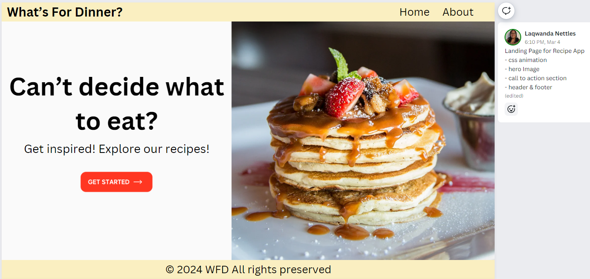
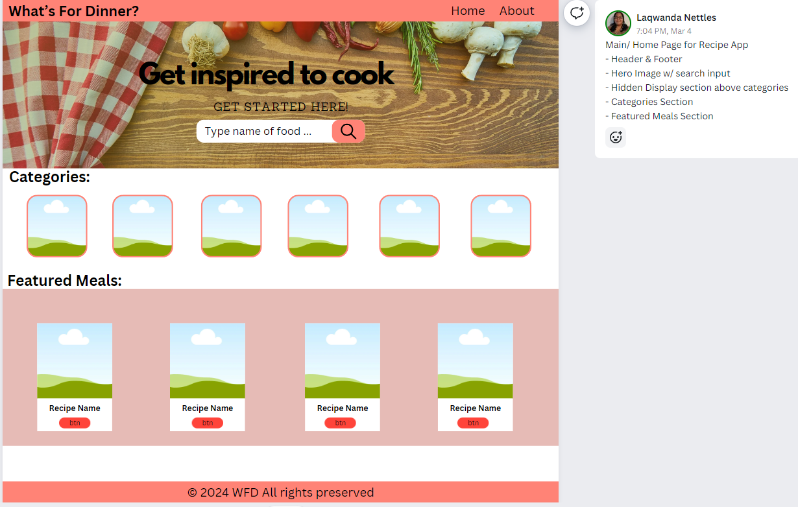
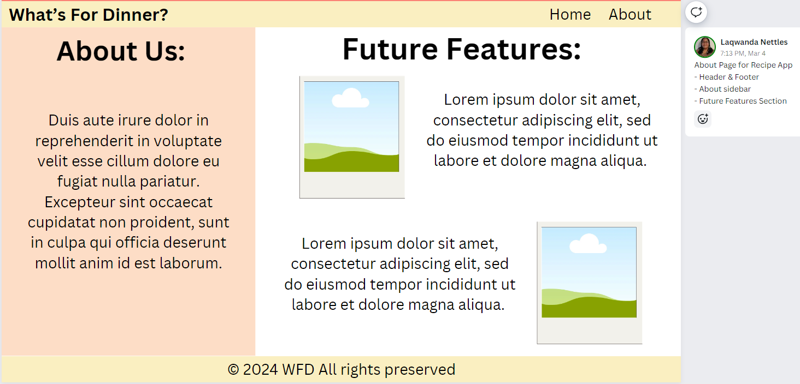

# Recipe-App

## About

This project was built using the techniques I've learned in class: API integration, object-oriented programming, and SCSS 7-1 architecture. It consists of three pages: landing, home, and about.

### Key Features

- CSS Animations: call-to-action section on landing page and drop-down menu for smaller screens.
- API Intergration:
  - Search Input: fetches recipes related to the search query and creates a card with the recipe image, name, and button to get the recipe.
  - Featured Section: fetches random recipes from the API and displays them as cards in the same format mentioned above.
  - Modal: When the 'Get Recipe' button is clicked on each card, it displays the recipe related to that card.
- CSS: use of of the CSS blur filter for about page.

## Wireframe

This is my plan for the website. The wireframe was created using Canva.  
Landing Page:  
  
Home Page:  
  
About Page:  

## Credits and Acknowledgements

The images used came from unsplash.com & themealdb API.  
Parts of the code were refrenced from MDN and W3Schools.

### Photo Credits

<a href="https://unsplash.com/photos/salad-on-white-ceramic-bow-l-T_dY6AzzVXU">Unsplash Image</a> by Sara Dubler  
<a href="https://unsplash.com/photos/a-table-topped-with-bags-filled-with-different-types-of-vegetables-HeP33WOkVqM">Unsplash Image</a> by Mockuuups  
<a href="https://unsplash.com/photos/assorted-fruits-on-brown-wooden-bowls-Yn0l7uwBrpw">Unsplash Image</a> by Jimmy Dean

### Code Credits

W3Schools: <a href="https://www.w3schools.com/howto/howto_css_menu_icon.asp">Menu Icon</a>  
W3Schools: <a href="https://www.w3schools.com/howto/howto_js_dropdown.asp">Clickable Dropdown</a>  
W3Schools: <a href="https://www.w3schools.com/howto/howto_css_modals.asp">CSS/JS Modal</a>  
MDN: <a href="https://developer.mozilla.org/en-US/docs/Learn/HTML/Howto/Use_data_attributes">Data Attributes</a>

## Reflections

### Day 1

- Reading API documentation & Testing API data. I created a Postman Collection for the API and added requests for each feature to understand how the data is displayed and how to access it.
- Drawing up designs in my notebook for desktop & mobile. Testing layouts by building a mock site on Replit.

#### Challenge

Trying to figure out how I want to display the website on different screens and where to start: Javascript or HTML/CSS.

#### Reflection

Keep it simple. Try not to overwhelm myself.

### Day 2

- Finished the layout process. Tested displaying & retrieving data from the API.
- Brainstorming content for the website: name, slogan, and message.

### Day 3

- Built a wireframe and found a color scheme.
- Created Repo with SASS 7-1 template. Customized SASS folders to fit the project.
- Finished & Designed Landing Page.

### Day 4

- Finished Home Page layout. I got the display section to work with search input. Implemented a modal and eventually got the featured section to work as well.

#### Challenge

The challenge I faced again was trying to figure out how I wanted to display the data fetched from the API. Also, implementing other features without breaking the previous one.

#### Reflection

How I've been handling each challenge I've come across is by researching and testing.  I watched so many Youtube videos related to recipe apps, especially one using the same API I chose. I compared how they used and displayed the data. Methods and concepts used that I didn't understand I researched W3Schools, MDN, and other articles related to the subject. I also created many test files to try out the different concepts and layouts. One of the interesting subjects I've come across is <a href="https://hopegiometti.medium.com/understanding-data-attributes-and-the-dataset-property-b3bd2db5a1e3">Data Attributes & Dataset Property</a>. Using this, I was able to target certain recipes IDs and link them to my 'Get Recipes' buttons, which allowed the modal to display a recipe's data/info.

### Day 5 & 6

- I researched different websites about pages to get inspiration and message content.
- Finished About Page. Used CSS's blur background filter. I was looking into parallax but decided against it because it's not fully supported.
- Implemented a drop-down menu for smaller screens.

#### Challenge

Trying to create a more cohesive design for smaller screens.

## Final Reflection

This project was an amazing learning experience. It furthered my knowledge of understanding APIs, the use of classes, and async await functions. The use of the SASS 7-1 architecture was definitely a game changer. Once I got used to using the different files and remembering to import them, designing the website took me half the time I'd spend using CSS. For this project, I heavily relied on sites like Pinterest, Google, Youtube, W3Schools, and MDN to find inspiration, examples, and code explanations. In summary, this project enhanced my knowledge of the subjects taught this semester.
